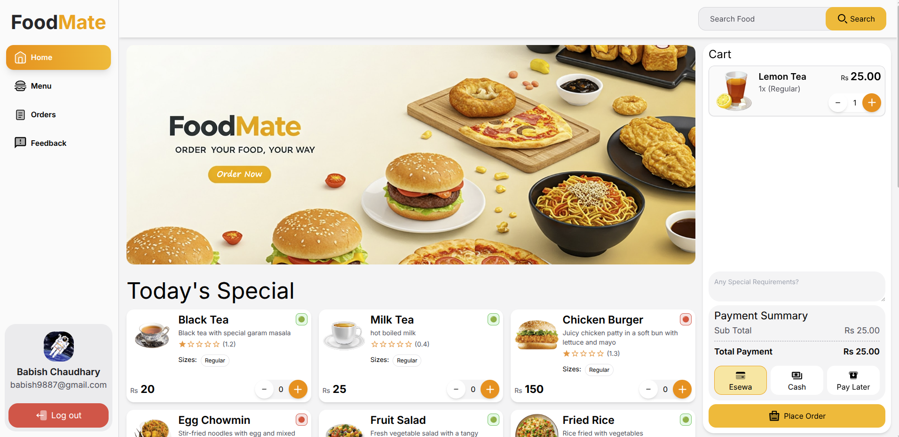
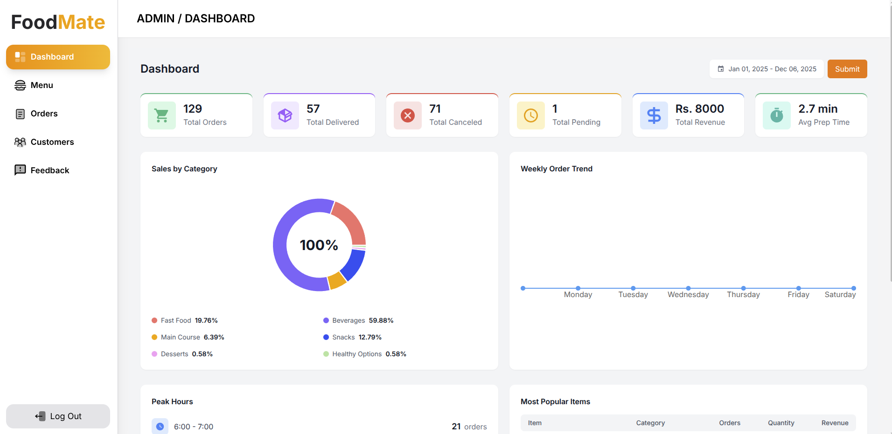
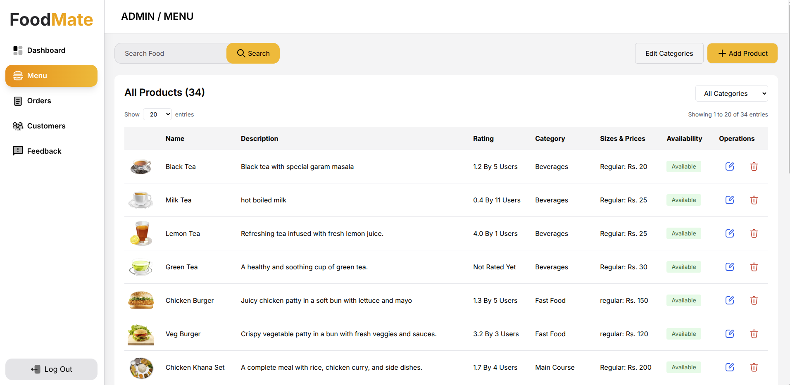
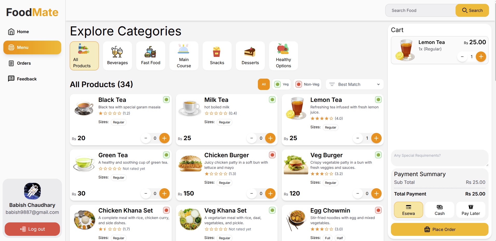
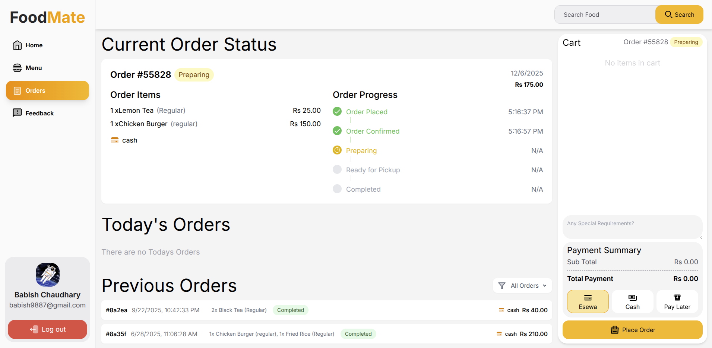
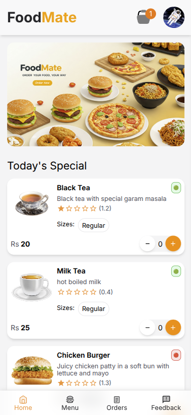
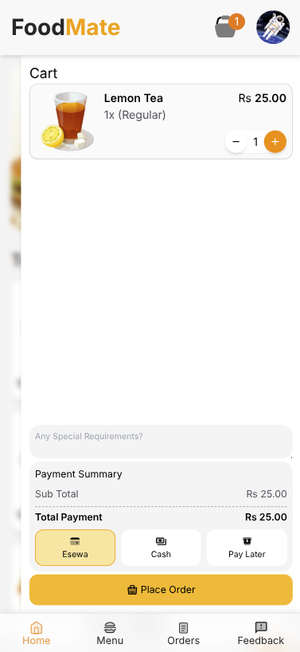

# 🍽️ FoodMate — Smart Canteen Management System



FoodMate is a modern web-based canteen management system designed to replace slow, manual, paper-based ordering with a fast, automated, and user-friendly digital platform. Built using **React + TypeScript + Vite**, **Node.js**, **Express**, and **MongoDB**, FoodMate provides a seamless experience for both users and administrators.

---

## 📖 Background

Many institutions still rely on traditional, manual processes in their canteens — paper orders, verbal communication, and cash transactions. These methods lead to:

- ⏱️ Long queues
- 🐌 Slow service
- ❌ Incorrect orders
- 💰 Inefficient cash handling
- 😞 Poor customer experience

**FoodMate** addresses these issues by enabling:

- 📱 Digital menu browsing
- ⚡ Fast online ordering
- 🔒 Secure online payments
- 📊 Real-time order tracking
- 🛠️ Efficient admin management tools

This project improves service quality, reduces wait times, minimizes errors, and offers a secure, transparent food ordering workflow.

---

## ✨ Features

### 👤 User Features

- ✅ User Registration & Login
- 🍕 Browse and search food items
- 🔍 Filter items by category
- 🛒 Add items to cart and place orders
- ❌ Cancel orders before preparation
- 📍 Track real-time order status
- 📜 View order history
- 📝 Add special notes while ordering
- ⭐ Rate food items and add feedback
- 💳 Digital payment integration (eSewa)

### 🧑‍💼 Admin Features

- 🔐 Admin Login
- ➕ Add / Update / Delete food items
- 🗂️ Manage categories
- 📋 View all orders & update their status
- 💬 Handle customer feedback
- 👥 Manage users (block, unblock, delete)
- 📊 Daily Dashboard (orders, revenue, cancellations)
- 🔎 Search orders by user
- 📄 Generate downloadable PDF invoices within date ranges

---

## 🛠️ Tech Stack

### Frontend
- ⚛️ React
- 📘 TypeScript
- ⚡ Vite
- 🎨 Tailwind CSS
- 🌐 Axios
- 🧭 React Router

### Backend
- 🟢 Node.js
- 🚀 Express.js
- 🍃 MongoDB
- 📦 Mongoose
- 🔑 JWT Authentication
- 🔐 AES Encryption

### Payment
- 💰 eSewa Payment Gateway Integration

---

## 🖼️ Screenshots

### Dashboard


### Admin Menu Management


### User Menu Page


### Home Page


### Order Tracking


### Mobile View - Home


### Mobile View - Cart


---

## 🚀 Installation & Setup

### Prerequisites
- Node.js (v16 or higher)
- MongoDB (local or cloud instance)
- npm or yarn

### Clone the Repository
```bash
git clone https://github.com/babish9887/FoodMate-V1
cd FoodMate
```

### Install Dependencies
```bash
npm install
```

### Environment Variables
Create a `.env` file in the root directory:
```env
VITE_API_URL=http://localhost:5000
VITE_ESEWA_MERCHANT_ID=your_merchant_id
```

### Start Development Server
```bash
npm run dev
```

### Build for Production
```bash
npm run build
```

### Preview Production Build
```bash
npm run preview
```

---

## 🤝 Contributing

Contributions are welcome! Please feel free to submit a Pull Request.

1. Fork the repository
2. Create your feature branch (`git checkout -b feature/AmazingFeature`)
3. Commit your changes (`git commit -m 'Add some AmazingFeature'`)
4. Push to the branch (`git push origin feature/AmazingFeature`)
5. Open a Pull Request

---

## 📧 Contact

For any queries, please reach out to: babishchaudhary.dev@gmail.com

